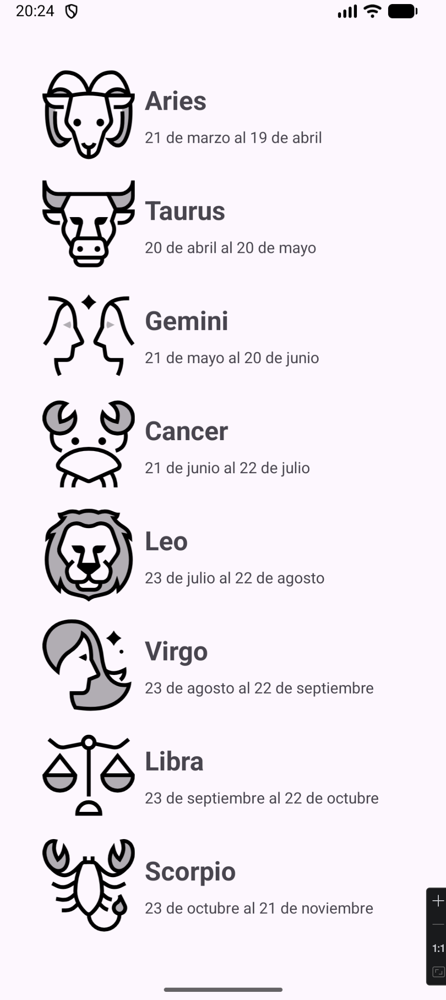
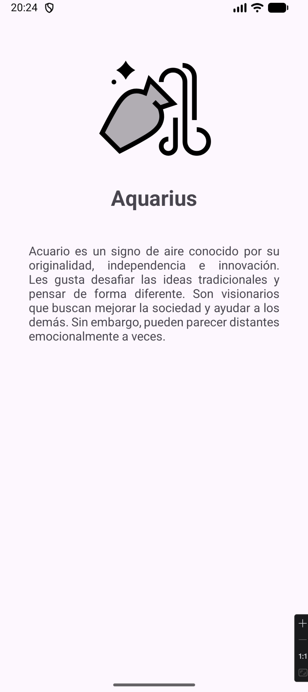
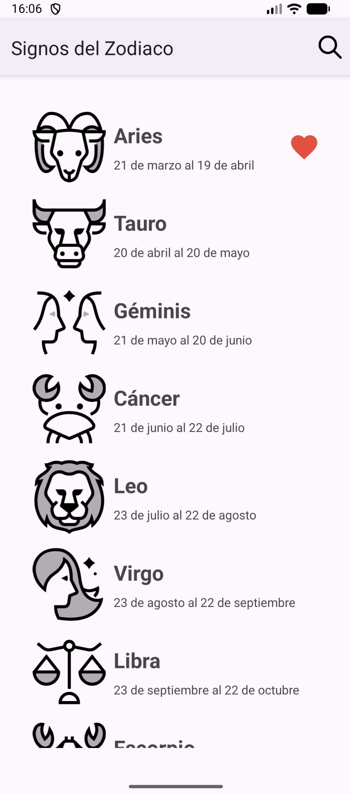
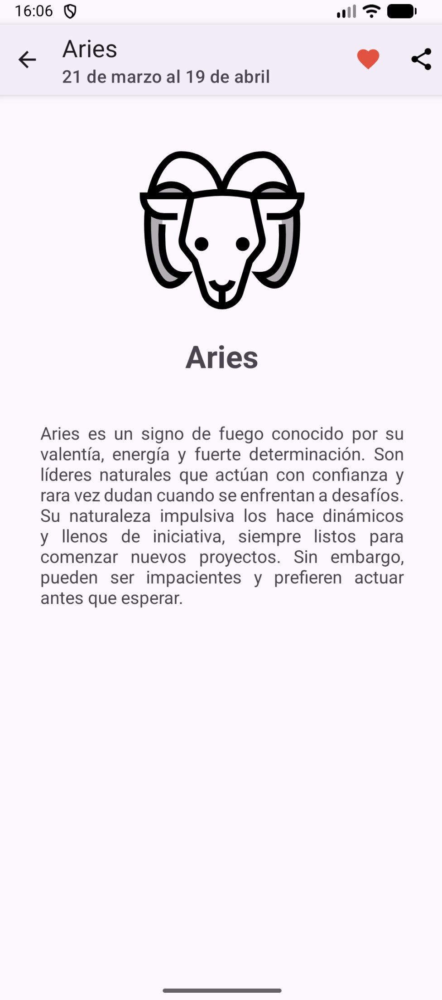

# 🌌 Zodiac App – Android Kotlin

**Descripción:**  
Aplicación nativa de Android desarrollada en Kotlin que muestra información sobre los signos del zodiaco. La app presenta una lista de horóscopos mediante un **RecyclerView** y permite navegar a una pantalla de detalle con nombre, imagen y descripción.

En su versión **v2.0**, se han añadido mejoras de interacción como búsqueda, sistema de favoritos y opciones de compartir.

---

## 📌 Funcionalidades

### 🔹 v1.0
- Lista de signos del zodiaco usando **RecyclerView**  
- Navegación a pantalla de detalle al hacer click  
- Envío de datos entre Activities mediante `Intent`  
- Pantalla de detalle con:
  - Nombre  
  - Imagen  
  - Descripción  
- Uso de recursos (`strings.xml`, `drawables`)  
- Modelo de datos `Horoscope`  

### 🔹 v2.0
- 🔍 Búsqueda de signos con **SearchView**  
- ❤️ Sistema de favoritos con persistencia (**SharedPreferences**)  
- ⭐ Indicador visual de favoritos en la lista  
- 🔗 Opción de compartir contenido (Intent ACTION_SEND)  
- 📱 Action Bar con acciones (favorito + compartir)  

---

## 🛠 Tecnologías utilizadas

- Kotlin  
- Android Studio  
- RecyclerView  
- Intents (Activity Navigation)  
- SharedPreferences  
- SearchView  
- Material Design Components  
- ConstraintLayout  

---

## 📷 Capturas de pantalla

### 🟢 v1.0
<p align="center">
  
  
</p>

### 🔵 v2.0
<p align="center">
  
  
</p>

---

## 📝 Lo que aprendí

- Uso de RecyclerView y Adapters  
- Navegación entre Activities con Intents  
- Paso de datos entre pantallas  
- Gestión de estado con **SharedPreferences**  
- Implementación de **SearchView** para filtrado  
- Manejo del **Action Bar y menús**  
- Mejora de UX con favoritos y compartir  

---

## 🚀 Cómo ejecutar

1. Clona el repositorio:

```bash
git clone https://github.com/tuusuario/zodiac_app.git
